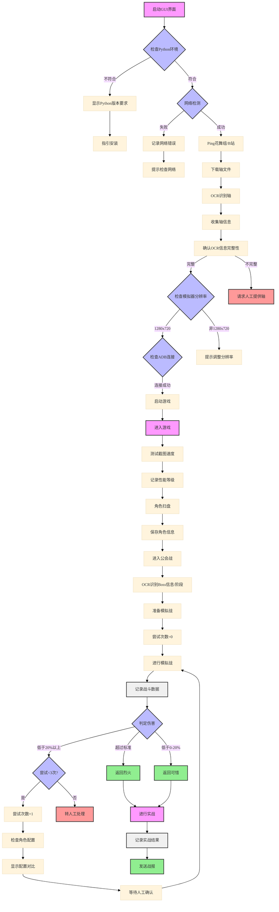

[toc]

# 常用符号

⚠️🚀📋👥✅⬜❌

# 流程图代码

- 使用mermaid

- 效果如下



# 项目进度追踪（待办事项）

- 通用模板

```markdown
# 🚀 项目进度追踪

## 📋 开发任务
| 状态 | 任务 | 备注 |
|:---:|---|---|
| ⬜ | 微调代码 | |
| ⬜ | 训练效率改进 | |
| ⬜ | 更简单的UI | |
| ⬜ | 公开数据集 | |
| ✅ | 中文发音 | 方言味浓重 |
| ⬜ | 标准普通话发音支持 | |

## 👥 角色支持
| 状态 | 角色 | 备注 |
|:---:|---|---|
| ❌ | ~~墨小菊~~ | 已移除计划 |
| ❌ | ~~文芷~~ | 已移除计划 |
| ✅ | 朝武芳乃 | |
| ✅ | 丛雨 | |
| ✅ | 常陆茉子 | |
| ✅ | 三司绫濑 | |
| ✅ | 在原七海 | |
| ✅ | 式部茉优 | |
| ✅ | 二条院羽月 | |
| ⬜ | ATRI | |

---
*图例：* ✅ 已完成 &nbsp;|&nbsp; ⬜ 待完成 &nbsp;|&nbsp; ❌ 已移除
```

# 目录

- 直接秒杀：`[toc]`

- 但是有一些是不支持`[toc]`的，本质是一个插件，比如github

- 所以还有一种是手动实现目录的方式，通过锚点连接

- ```bash
  # 目录
  
  - [项目介绍](#项目介绍)
  - [温馨提示](#温馨提示)
  - [使用](#使用)
  - [项目扩展](#项目扩展)
  
  # 项目介绍
  
  - 项目名称：ReNameFile
  - 项目描述：一个批量重命名文件工具，可以批量重命名指定目录下的所有文件
  ```

- 上面就是手动实现的参考模版
